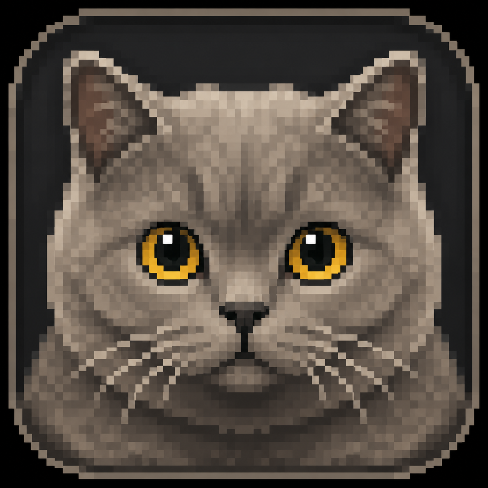

<h1 align="center">
  
  <br>Ghosttal
</h1>

<p align="center">
  A motion-focused Ghostty fork with fluid cursor motion and animated typing.
</p>

Ghosttal keeps Ghostty's fast native terminal engine and adds GPU-rendered motion that
makes the cursor and newly typed characters easier to track.

## Download

Ghosttal currently supports macOS 13 or later and ships as a universal application for
Apple silicon and Intel.
Download the latest notarized DMG from
[GitHub Releases](https://github.com/ccyisafool/ghosttal/releases/latest), open it, and
drag `Ghosttal.app` onto the Applications shortcut.

Every release includes `SHA256SUMS`. To verify a downloaded installer:

```sh
shasum -a 256 -c SHA256SUMS
spctl --assess --type open --context context:primary-signature --verbose=2 Ghosttal-*.dmg
```

Ghosttal uses its own bundle identifier and can be installed alongside stock Ghostty.

## Motion controls

All settings are shown with their defaults; put overrides in your Ghosttal overlay
(see [Configuration](#configuration)):

```ini
cursor-motion = smear
cursor-motion-duration = 150
cursor-motion-respect-reduce-motion = true
input-motion = true
input-motion-duration = 150
input-motion-intensity = 1
input-motion-respect-reduce-motion = true
```

Cursor modes are `none`, `ease`, `spring`, `smear`, and `squash`. Both effects respect
macOS Reduce Motion by default.

## Configuration

Ghosttal loads an existing Ghostty configuration as its base, then applies an optional
Ghosttal overlay. On macOS the overlay is:

```text
~/Library/Application Support/com.chenyangcheng.ghosttal/config.ghostty
```

The cross-platform overlay is `$XDG_CONFIG_HOME/ghosttal/config.ghostty`. Using
**Ghosttal → Open Configuration** creates or opens the overlay, so motion-only settings
do not have to alter the configuration used by stock Ghostty.

Ghosttal intentionally reads Ghostty's configuration first for compatibility, but writes
its own overlay, crash reports, update state, and application data under Ghosttal-specific
paths. Removing Ghosttal does not remove or rewrite stock Ghostty's configuration.

## Updates

Use **Ghosttal → Check for Updates…**, or let the automatic background checks run
(controlled by the `auto-update` setting).

Ghosttal updates itself through its own signed Sparkle feed
(`appcast.xml` on this repository's `main` branch), backed by the DMGs on the
Releases page. Ghosttal never consumes Ghostty's Sparkle feed. Upstream Ghostty
changes reach users only after they are merged, tested, and released here — see
[docs/UPSTREAM-SYNC.md](docs/UPSTREAM-SYNC.md).

## Building

Install Zig 0.16.0, Nushell, and Xcode 26 or later, then build the shared core and
macOS app:

```sh
zig build -Demit-macos-app=false -Doptimize=ReleaseFast
./macos/build.nu --scheme Ghostty --configuration Release --action build
```

Run targeted Zig tests with:

```sh
zig build test -Dtest-filter=cursor-motion
```

Maintainer release process: see [docs/UPSTREAM-SYNC.md](docs/UPSTREAM-SYNC.md).

See [CONTRIBUTING.md](CONTRIBUTING.md) for contribution checks and
[SECURITY.md](SECURITY.md) for private vulnerability reporting.

## Upstream and attribution

Ghosttal is derived from [Ghostty](https://github.com/ghostty-org/ghostty) and retains
Ghostty's MIT license and copyright notice. Ghosttal is not affiliated with or endorsed
by the Ghostty project.

For upstream terminal documentation and architecture, see the
[Ghostty documentation](https://ghostty.org/docs) and
[Ghostty source](https://github.com/ghostty-org/ghostty).

## License

MIT. See [LICENSE](LICENSE).
